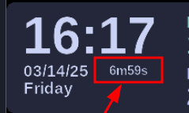

# vr_stopwatch

a small stopwatch for use in wlxoverlay-s



## how

```
# get zig 0.14.0: https://ziglang.org
zig build
```

then configure your wlxoverlay-s' `watch.yaml` accordingly, something like this:
```yaml
  - type: Label
    rect: [120, 115, 3, 3]
    font_size: 11
    fg_color: "#cad3f5"
    bg_color: "#5b6078"
    source: Exec
    command: [ "/path/to/your/vr_stopwatch" ]
    interval: 1
```
